# 💫 About Me

Hey there 👋 I’m Ezekiel — part full-stack developer, part blue-team sentinel, part DevOps tinkerer, and always caffeinated by curiosity. I build secure, scalable, and elegant systems at the intersection of **JavaScript**, **cybersecurity**, and **cloud-native DevOps**.

💻 By day, I code dynamic MERN stack apps that solve real-world problems.  
🛡️ By night, I monitor threat landscapes, respond to incidents, and harden infrastructures.  
⚙️ And somewhere in between, I automate CI/CD pipelines, containerize everything, and deploy with zero-downtime swagger.

🔭 Currently working on:
- Building real-time apps with React, Node.js, MongoDB, and Express.
- Automating security and deployment workflows with GitHub Actions, Docker, and Bash.
- Designing blue team labs and alerting systems using Python, ELK, and open-source SIEMs.

🤝 Open to:
- Collaborations on open source (esp. devtools, security tooling, or ethical hacking labs).
- Contributions to projects where **Dev meets Sec** — because strong apps need strong armor.
- Conversations about code quality, SOC maturity models, or building infra like a boss.

📫 Let’s connect:
Whether you’re a developer, recruiter, or fellow tech mind — DM me for collaborations, ideas, or to swap favorite terminal aliases.

## 🌐 Socials:
[](https://instagram.com/GituraEzekiel) [](https://linkedin.com/in/EzekielWairimu) [](https://medium.com/@WaweruEzekiel)

---

# 📊 GitHub Stats:
<br/>
<br/>


## 🏆 GitHub Trophies


---
## 💼 Projects I'm Proud Of

🛡️ **CryptoSage** – Real-Time Cryptocurrency Advisor with Built-in Risk Assessment  
> A Python-based crypto advisor chatbot using Gradio, real-time API integration, and profitability/sustainability scoring.<br>
> 🧠 NLP-driven, rule-based engine<br>
> 📈 Live price fetching<br>
> 🔐 Built with secure coding practices<br>  
[Repo Link](https://github.com/EzekielGitura/cryptosage)

🔧 **SprintCare Garage Management System (SCA-GMS)** – Auto Garage Fullstack Web App  
> Tracks commissions, employee check-ins, car washes, and daily revenue in a mobile-first React + Express stack.<br>  
> 🌍 PostgreSQL DB<br>
> 🛠️ Role-based access<br>
> 📩 Owner notifications via dashboard<br>  
[Repo Link](https://github.com/EzekielGitura/sprintcare-gms)

📦 **Blue Team Labs** – SOC Analyst Home Lab Setup  
> An evolving collection of detection rules, log analysis configs, and blue team tooling for security analysts.<br>  
> 🚨 Elastic Stack<br>
> 🧪 Zeek + Suricata configs<br>
> 📚 Threat-hunting case studies<br>  
[Repo Link](https://github.com/EzekielGitura/blue-team-labs)

🚀 **DevOps Pipelines as Code** – Automating Deployments and Testing  
> Hands-on CI/CD pipelines using GitHub Actions, Docker, and bash scripting.<br>  
> 🛠️ End-to-end automation for Node.js + Python projects<br>  
[Repo Link](https://github.com/EzekielGitura/devops-pipelines)

📊 **Cyber Threat Intel Dashboard** *(Coming Soon)*  
> A web dashboard visualizing real-time threat feeds (AbuseIPDB, VirusTotal) using React, Flask & Chart.js.

---

## 🧠 Core Stack  


## 🧰 Fluent In  


---

## 📈 Career Journeys (Interactive)

### 🔥 MERN Stack Developer Journey

```mermaid

gantt
  title MERN Stack Developer Journey 🛠️
  dateFormat  YYYY-MM-DD
  section Foundations
  HTML/CSS/JS - Basics               :done,    f1, 2025-01-01, 4w
  Responsive Web Design             :done,    f2, 2025-01-29, 2w
  TypeScript Basics                 :done,    f3, 2025-02-12, 2w
  Git & GitHub                      :done,    f4, 2025-02-26, 1w
  Funza Capstone (HTML/CSS/JS)      :done,    f5, 2025-03-01, 2w

  section Programming Logic & Backend
  Python Fundamentals               :done,    b1, 2025-03-15, 3w
  COVID-19 Tracker (Python Project) :done,    b2, 2025-04-05, 2w
  REST APIs                         :done,    b3, 2025-04-15, 1w
  MongoDB + Mongoose                :done,    b4, 2025-04-22, 1w
  Express.js                        :done,    b5, 2025-04-29, 1w

  section Fullstack Core
  React.js                          :done,    s1, 2025-05-01, 2w
  Node.js                           :done,    s2, 2025-05-15, 2w
  MERN Stack Integration            :done,    s3, 2025-06-01, 3w
  Authentication + JWT             :done,    s4, 2025-06-21, 1w
  Task Manager Project              :done,    s5, 2025-06-25, 2w
  WebSockets & Postman              :done,    s6, 2025-07-10, 2w
  Pitch Deck & Demo Video           :done,    s7, 2025-07-25, 1w

```

### Python Learning Journey
```mermaid
gantt
  title Python Developer Journey 🐍
  dateFormat  YYYY-MM-DD
  section Core Python
  Syntax & Variables                :done,    p1, 2025-01-01, 2w
  Control Flow & Loops             :done,    p2, 2025-01-15, 2w
  Functions & Modules              :done,    p3, 2025-02-01, 2w
  Data Structures (Lists, Dicts)   :done,    p4, 2025-02-15, 2w

  section Intermediate Python
  File Handling                    :done,    p5, 2025-03-01, 1w
  Error Handling                   :done,    p6, 2025-03-08, 1w
  APIs with `requests`             :done,    p7, 2025-03-15, 1w
  OOP in Python                    :done,    p8, 2025-03-22, 1w

  section Real-World Application
  Project: COVID-19 Tracker        :done,    p9, 2025-04-01, 2w
  Project: CLI Tools               :active,  p10, 2025-04-15, 1w
  Git & GitHub                     :done,    p11, 2025-04-20, 1w
```

### SOC & Cybersecurity Analyst Progression
```mermaid
    Foundation
        IT Support & Troubleshooting         : 2w
        Networking (Cisco, HCIA WLAN)       : 3w
        Linux (Kali, Ubuntu, WSL)           : 6w
        Security+ & Cyber Hygiene           : 1w
    Analyst Phase
        SIEM & Log Analysis                 : 2w
        Threat Intelligence & MITRE ATT&CK  : 2w
        Incident Response Drills            : 5w
        Wireshark & Packet Analysis         : 4w
    Specialization
        SOC Tier 1 Real-Time Monitoring     : 4w
        Vulnerability Assessment            : 2w
        CTFs & Red/Blue Team Exercises      : ongoing
        Cloud Security + IAM                : ongoing
```

### 🚀 DevOps / Cloud Path
```mermaid
gantt
title DevOps Cloud Journey
sections
section Dev Foundations
Linux & Shell Scripting :done, dev1, 2024-04-01, 7w
Git & GitHub            :done, dev2, 2024-08-15, 3w
section CI/CD + Containers
Docker & Docker Compose :done, dev3, 2023-04-01, 2w
CI/CD with GitHub Actions:done, dev4, 2023-04-15, 1w
section Monitoring + Infra as Code
Cloud (AWS, Render)     :active, dev5, 2025-02-01, 4w
IaC (Terraform)         :active, dev6, 2023-01-20, 4w
```

---

## 🧮 Contact Info
```bash
┌──────────────────────────────────────────────┐
│     Ezekiel Waweru      │
├──────────────────────────────────────────────┤
│  📫 Email     : gituraezekiel@gmail.com      │
│  🧠 Mobile    : +254727550182      │
│  📝 Blog      : blog.kassiopei.tech           │
│  🧰 Portfolio : kassiopei.vercel.app          │
│  📍 Location  : Kiambu, Kenya                │
└──────────────────────────────────────────────┘
```
---

## 🚀 Currently Learning  


---

### ✍️ Random Dev Quote


---
[](https://visitcount.itsvg.in)

<!-- Proudly created with GPRM ( https://gprm.itsvg.in ) -->
